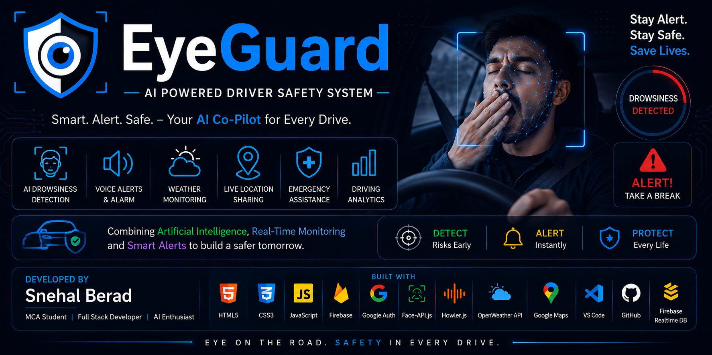
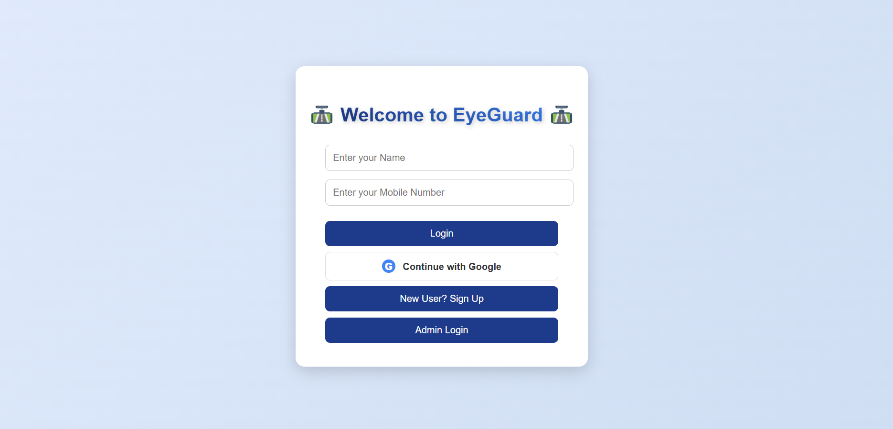
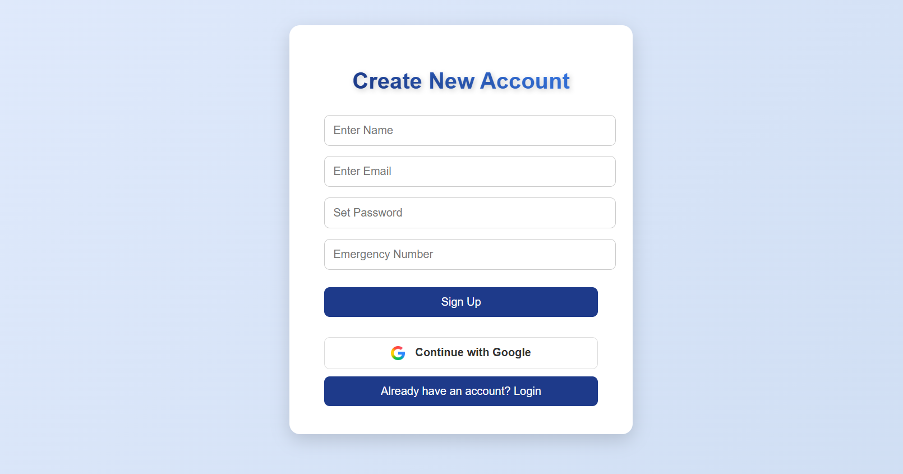
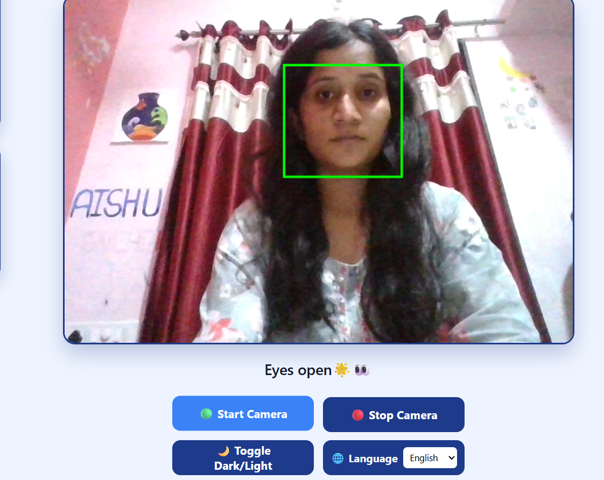
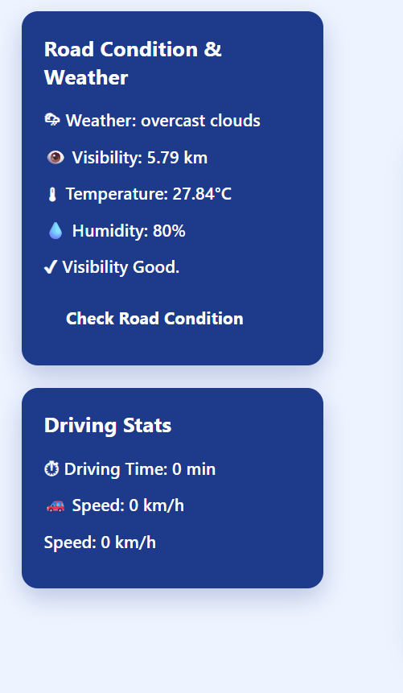
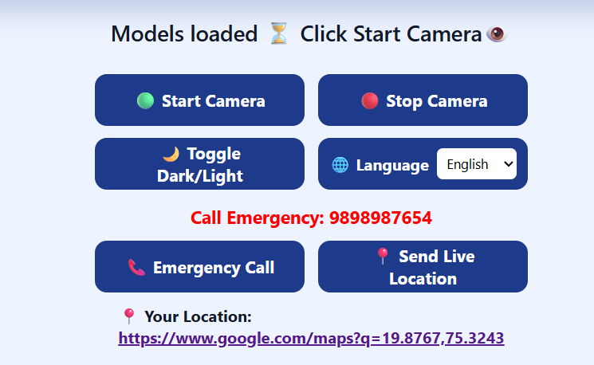
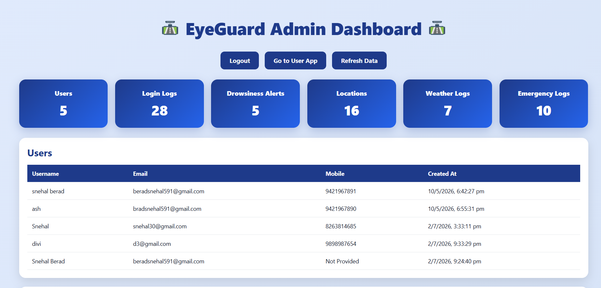

<p align="center">
  
</p>

# 🚗 EyeGuard – AI Powered Driver Drowsiness Detection & Road Safety System

<p align="center">
  
  
  
  
  
  
  
  
  
  
</p>

<p align="center">
  AI-powered Driver Safety System built using <b>Computer Vision</b>, <b>Firebase</b>,
  <b>Google Authentication</b>, <b>Face Detection</b>, <b>Voice Alerts</b>,
  <b>Weather Monitoring</b>, and <b>Real-Time Emergency Assistance</b>.
</p>

---

## 📖 Project Overview

EyeGuard is an intelligent web application designed to improve road safety by detecting driver drowsiness in real time using Artificial Intelligence and Computer Vision.

The system continuously monitors the driver's face through the webcam, detects eye closure, alerts the driver using voice and alarm notifications, monitors weather conditions, provides emergency assistance, and stores all activity securely in Firebase.

This project was developed as a real-world portfolio project demonstrating AI, Web Development, Firebase Integration, Authentication, and Real-Time Monitoring.

---

## 🌐 Live Demo

🔗 [Open EyeGuard Live](https://snehalberad30.github.io/EyeGuard/login.html)

---

## ✨ Key Features

- 👁️ AI Driver Drowsiness Detection
- 🎥 Real-time Face Detection
- 🔊 Voice Alert System
- 🚨 Alarm Notification
- 🌦 Live Weather Monitoring
- 📍 Live Location Sharing
- 🗺 Google Maps Integration
- 📞 Emergency Call
- 🔐 Manual Login & Signup
- 🔑 Google Authentication
- ☁ Firebase Realtime Database
- 📊 Admin Dashboard
- 🎤 Voice Commands
- 🌙 Dark / Light Theme
- 🌍 Multi-language Support
- 🚗 Driving Time Monitoring
- 📈 Driving Analytics

---

## 🛠 Technology Stack

| Category | Technologies |
|---|---|
| Frontend | HTML5, CSS3, JavaScript |
| Database | Firebase Realtime Database |
| Authentication | Firebase Authentication, Google Sign-In |
| AI / Computer Vision | Face API.js |
| Voice | Web Speech API, Speech Synthesis API |
| Audio | Howler.js |
| Maps | Google Maps |
| Location | Geolocation API |
| Weather | OpenWeather API |
| IDE | Visual Studio Code |
| Version Control | Git & GitHub |

---

## 📸 Application Screenshots

### 🔐 Login Page



---

### 📝 Sign Up Page



---

### 👁️ AI Camera Detection



---

### 🌦 Weather Monitoring



---

### 📍 Live Location Sharing



---

### 📊 Admin Dashboard



---

## 🏗 System Architecture

```text
                    ┌──────────────────────────┐
                    │        User Login        │
                    │ Manual / Google Sign-In  │
                    └─────────────┬────────────┘
                                  │
                                  ▼
                     ┌────────────────────────┐
                     │    Driver Dashboard    │
                     └─────────────┬──────────┘
                                   │
      ┌──────────────┬─────────────┼──────────────┬─────────────┐
      ▼              ▼             ▼              ▼             ▼
 Face Detection   Weather API   Voice Alerts   Live Location   Admin
      │              │             │              │            Dashboard
      ▼              ▼             ▼              ▼
 Drowsiness      Road Status    Alarm System   Google Maps
 Detection
      │
      ▼
Firebase Realtime Database
      │
      ▼
Activity Logs & Analytics
```

---

## 🔄 Project Workflow

```text
User Opens EyeGuard
        │
        ▼
Login / Google Authentication
        │
        ▼
Dashboard Opens
        │
        ▼
Camera Starts
        │
        ▼
Face Detection
        │
        ▼
Eye Landmark Detection
        │
        ▼
Drowsiness Monitoring
        │
        ├──────────────┐
        ▼              ▼
Normal State     Drowsiness Detected
        │              │
        ▼              ▼
Keep Monitoring  Voice Alert + Alarm
                       │
                       ▼
           Emergency Assistance
                       │
        ┌──────────────┴─────────────┐
        ▼                            ▼
Weather API                 Live Location
        │                            │
        └──────────────┬─────────────┘
                       ▼
          Firebase Realtime Database
                       │
                       ▼
             Admin Dashboard Logs
```

---

## 📂 Project Structure

```text
EyeGuard/
│
├── assets/
│   ├── banner/
│   │   └── eyeguard-banner.png
│   ├── screenshots/
│   │   ├── login-page.png
│   │   ├── signup-page.png
│   │   ├── camera-detection.png
│   │   ├── weather.png
│   │   ├── location.png
│   │   └── admin-dashboard.png
│   └── icons/
│
├── libs/
│   └── models/
│
├── index.html              # Main Driver Dashboard
├── login.html              # User Login
├── signup.html             # User Registration
├── admin-login.html        # Admin Login
├── admin.html              # Admin Dashboard
│
├── login.js
├── signup.js
├── script3.js
├── admin-login.js
├── admin.js
│
├── login.css
├── style2.css
├── admin.css
│
└── README.md
```

---

## 📦 Core Modules

### 👤 Authentication
- Manual Login
- Manual Signup
- Google Authentication
- Firebase Authentication

### 🤖 AI Monitoring
- Face Detection
- Eye Closure Detection
- Drowsiness Detection
- Voice Alerts
- Alarm System

### 🌍 Smart Monitoring
- Weather Monitoring
- Live Location Sharing
- Google Maps Integration
- Emergency Assistance

### 📊 Admin Dashboard
- User Management
- Login Logs
- Drowsiness Logs
- Weather Logs
- Location Logs
- Emergency Logs

---

## ⚙️ Installation Guide

Follow these steps to run EyeGuard locally:

### 1️⃣ Clone the Repository

```bash
git clone https://github.com/snehalberad30/EyeGuard.git
```

### 2️⃣ Open the Project

Open the project folder using **Visual Studio Code**.

### 3️⃣ Start Live Server

Install the **Live Server** extension in VS Code.

Right-click on `login.html` → **Open with Live Server**

### 4️⃣ Configure Firebase

Create your Firebase project and enable:

- Firebase Authentication
- Realtime Database
- Google Authentication

Update the Firebase configuration inside:

- `login.js`
- `signup.js`
- `script3.js`
- `admin.js`

### 5️⃣ Allow Browser Permissions

Allow the following permissions:

- 📍 Location
- 🎤 Microphone
- 📷 Camera
- 🔊 Audio

The application is now ready to use.

---

## 📋 Feature Summary

| Feature | Status |
|---|---|
| Manual Login | ✅ |
| Google Login | ✅ |
| Manual Signup | ✅ |
| Google Signup | ✅ |
| Face Detection | ✅ |
| Drowsiness Detection | ✅ |
| Voice Commands | ✅ |
| Alarm Alerts | ✅ |
| Live Location | ✅ |
| Google Maps | ✅ |
| Weather Monitoring | ✅ |
| Firebase Database | ✅ |
| Admin Dashboard | ✅ |
| Emergency Assistance | ✅ |
| Multi-language Support | ✅ |
| Driving Analytics | ✅ |

---

## 🌍 Why EyeGuard?

Driver drowsiness is a serious road safety risk and can lead to accidents due to reduced attention, delayed reaction time, and fatigue.

EyeGuard addresses this real-world problem by combining:

- Artificial Intelligence
- Computer Vision
- Real-Time Face Monitoring
- Voice Alerts
- Weather Analysis
- Google Maps
- Live Location Sharing
- Firebase Cloud Services

The objective is to enhance driver safety and reduce accidents caused by fatigue.

---

## 💡 Skills Demonstrated

This project demonstrates practical experience in:

- Frontend Web Development
- JavaScript Programming
- Firebase Authentication
- Firebase Realtime Database
- Google OAuth Integration
- Computer Vision
- Face Detection
- API Integration
- Geolocation Services
- Voice Recognition
- Responsive UI Design
- Git & GitHub

---

## 🚀 Future Enhancements

- Mobile Application for Android & iOS
- AI Driver Fatigue Prediction
- Driver Risk Score
- Cloud Analytics Dashboard
- SMS Emergency Alerts
- Email Notifications
- GPS Route Tracking
- Offline AI Detection
- Accident Detection using Sensors
- IoT Integration
- Machine Learning Based Driver Behaviour Analysis

---

## 👨‍💻 Developer

**Snehal Berad**

MCA Student | Full Stack Developer | AI & Firebase Enthusiast

### Skills

- HTML
- CSS
- JavaScript
- Firebase
- Google Authentication
- Face API.js
- AI
- Computer Vision
- Git & GitHub

⭐ If you like this project, don't forget to star this repository.